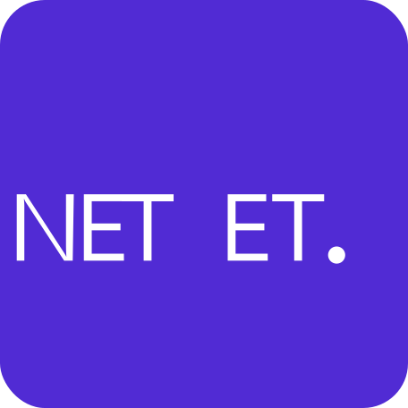

# Debugging .NET Applications with mirrord

<div align="center">
  <a href="https://mirrord.dev">
    
  </a>
  <a href="https://dotnet.microsoft.com/">
    
  </a>
</div>

## Overview

This is a sample web application built with ASP.NET Core and Redis to demonstrate debugging Kubernetes applications using mirrord. The application is a guestbook that stores entries using Redis and displays them on a web interface.

## Prerequisites

- .NET 9.0 SDK or higher
- Docker and Docker Compose
- Kubernetes cluster
- mirrord CLI installed
- macOS or Linux (Windows users can use WSL2)

## Quick Start

1. Clone the repository:

```bash
git clone https://github.com/metalbear-co/mirrord-dotnet-debug-example
cd mirrord-dotnet-debug-example
```

2. Deploy to Kubernetes:

```bash
kubectl create -f ./kube
```

3. Port-forward Redis to your local machine:

```bash
mirrord port-forward -L 6379:redis:6379
```

4. In a separate terminal, run with mirrord:

```bash
mirrord exec -f mirrord.json -- dotnet run --project src
```

The application will be available at http://localhost:8080

## Architecture

The application consists of:
- ASP.NET Core web server
- Redis instance for storing guestbook entries

## License

This project is licensed under the MIT License - see the LICENSE file for details.
